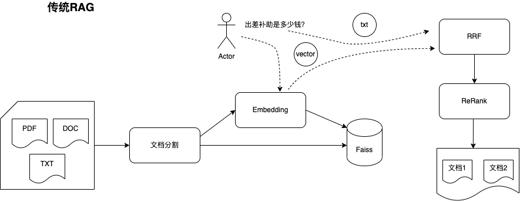

# RAG 项目

本项目是一个基于 Retrieval-Augmented Generation (RAG) 模型的文本处理工具，主要用于文本检索与生成，包含以下功能模块：
- **重排序（Rerank）**：对检索结果进行重新排序，以提高结果的相关性。
- **相似度匹配（Similarity Matching）**：基于嵌入模型计算文本的相似度。
- **文本分割（Text Splitting）**：将长文本分割为适合处理的较小段落。

本项目可以处理多种数据源，比如非结构化的PDF、Docx等，通过切片和排序等策略，获取与问题最相关的答案，并集成VLLM来对开源的大模型进行推理。

## 项目线路

<p align="center">
  
</p>


## 安装

1. 克隆本项目代码：
   ```bash
   git clone https://github.com/TW-NLP/RAG_QA
   cd RAG_QA
   ```

2. 安装依赖：
   ```bash
   pip install -r requirements.txt
   ```

3. 模型权重下载：
   - 需要从 [huggingface.co](https://huggingface.co/BAAI/bge-large-zh-v1.5) 下载 `pytorch_model.bin` 文件，并放入 `pre_model/embedding_model/bge-large-zh` 目录下。
   - 需要从 [huggingface.co](https://huggingface.co/BAAI/bge-reranker-large) 下载 `pytorch_model.bin` 文件，并放入 `pre_model/rerank_model/rerank_large` 目录下。

## 使用说明

1. 运行项目的主脚本 `main.py` 来进行全文检索和生成任务：
   ```bash
   python main.py
   ```
## 路线图

- [X] 支持bge embedding
- [X] 支持 rerank
- [X] 支持 Docx、PDF的处理
- [ ] 支持对问题进行改写的RAG
- [ ] 支持融合知识图谱的问答
- [ ] 添加大模型的推理

## 贡献指南

如果你想为本项目贡献代码，请先 Fork 本仓库并提交 Pull Request。确保代码格式符合项目的要求，并通过所有测试。

## 许可证

本项目遵循 MIT 许可证。
